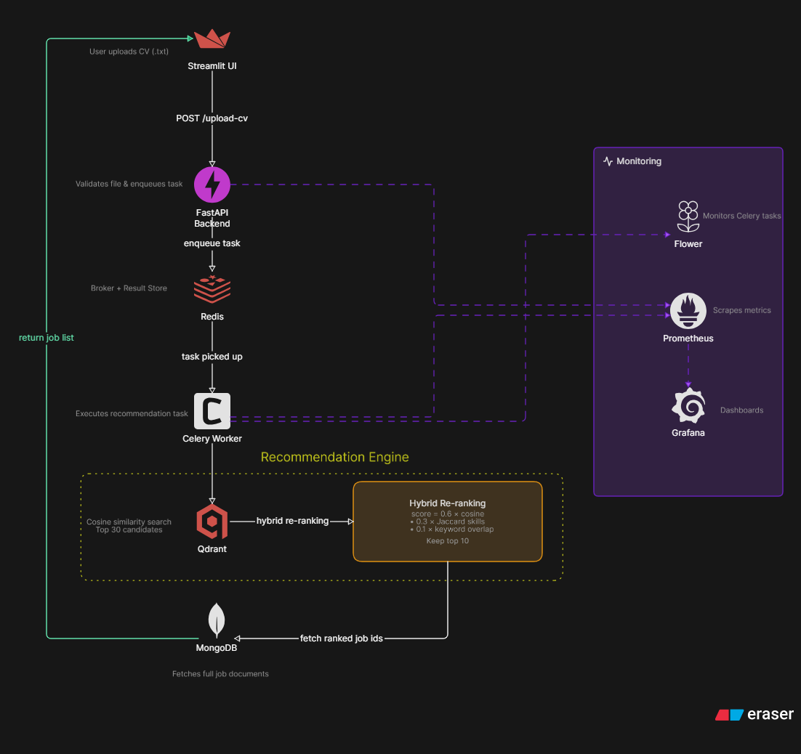

# Job Recommendation Application

The Job Recommendation Application provides the production interface for the AI-powered recommendation system. It integrates the recommendation engine, backend APIs, asynchronous task processing, and an interactive user interface to deliver personalized job recommendations.

The application is designed as a modular system consisting of:

- **Backend API** built with FastAPI
- **Asynchronous recommendation pipeline** powered by Celery
- **Interactive frontend** built with Streamlit
- **MongoDB** for data persistence
- **Monitoring** using Prometheus
- **Recommendation Engine** for ranking and retrieval

---

# Architecture

> **Architecture diagram goes here**

<h2 align="center">System Architecture</h2>

<p align="center">
  
</p>

# Table of Contents

- Overview
- Architecture
- Project Structure
- Backend
- Frontend
- Recommendation Engine
- Monitoring
- Running the Application
- API Endpoints
- Background Tasks
- Technology Stack

---

# Project Structure

```text
job-recommendation-app/
│
├── backend/
│   ├── api/
│   ├── core/
│   ├── db/
│   ├── models/
│   ├── services/
│   ├── tasks/
│   ├── config.py
│   └── main.py
│
├── frontend/
│   └── app/
│
├── monitoring/
│
├── recommendation_engine/
│
└── testing_cvs/
```

---

# Backend

The backend is implemented using **FastAPI** and serves as the central component of the application. It exposes REST APIs, coordinates recommendation requests, communicates with the database, and delegates computationally intensive tasks to Celery workers.

## Components

### API

Contains all REST API routes.

Current endpoints include:

- CV upload
- Health checks

---

### Core

Core application configuration.

Contains:

- Celery application
- Shared backend configuration

---

### Database

Responsible for database connectivity.

Current implementation:

- MongoDB connection
- Database initialization

---

### Models

Contains application data models.

Examples include:

- Job model
- CV model

---

### Services

Business logic used by the API.

Responsibilities include:

- Job retrieval
- Recommendation orchestration
- Service-layer abstractions

---

### Tasks

Contains asynchronous Celery tasks.

Responsibilities include:

- Recommendation generation
- Long-running background jobs

---

# Frontend

The frontend is implemented using **Streamlit** and provides an interactive interface for users to upload CVs, browse recommendations, and interact with the recommendation engine.

Current features include:

- CV upload
- Recommendation visualization
- Interactive dashboard

---

# Recommendation Engine

The recommendation engine is responsible for matching candidate profiles with relevant job postings.

Main responsibilities include:

- Candidate embedding generation
- Job embedding retrieval
- Similarity search
- Candidate-job ranking
- Recommendation scoring

---

# Monitoring

Monitoring is implemented using **Prometheus** to collect application metrics and monitor system health.

The monitoring module includes:

- Prometheus configuration
- Docker Compose deployment
- Application metrics

---

# Running the Application

## 1. Start the FastAPI Backend

Navigate to the backend directory.

```bash
cd job-recommendation-app/backend
```

Run the FastAPI server.

```bash
uvicorn main:app --reload
```

---

## 2. Start the Celery Worker

From the backend directory, execute:

```bash
celery -A core.celery_app:celery_app worker --pool=solo --loglevel=debug
```

---

## 3. Start Flower Dashboard

Flower provides a web interface for monitoring Celery workers and background tasks.

```bash
celery -A core.celery_app:celery_app flower
```

---

## 4. Launch the Streamlit Frontend

Navigate to the frontend directory.

```bash
cd ../frontend
```

Run the Streamlit application.

```bash
streamlit run ./app/main.py
```

---

# Typical Startup Sequence

```text
Start MongoDB
      │
      ▼
Start FastAPI
      │
      ▼
Start Celery Worker
      │
      ▼
Start Flower
      │
      ▼
Start Streamlit
```

---

# API Endpoints

| Endpoint | Description |
|----------|-------------|
| `/health` | Health check endpoint |
| `/cv` | Upload CV and request recommendations |

---

# Background Processing

Long-running recommendation tasks are executed asynchronously using **Celery**.

Typical workflow:

```text
Client Request
       │
       ▼
FastAPI
       │
       ▼
Celery Task Queue
       │
       ▼
Recommendation Engine
       │
       ▼
Database
       │
       ▼
Response
```

---

# Technology Stack

| Component | Technology |
|------------|------------|
| Backend | FastAPI |
| Frontend | Streamlit |
| Task Queue | Celery |
| Broker | Redis *(if applicable)* |
| Database | MongoDB |
| Monitoring | Prometheus |
| Recommendation | Sentence Transformers / FAISS *(update if needed)* |

---

# Future Improvements

- User authentication
- Recommendation history
- Batch recommendation processing
- Model versioning
- Kubernetes deployment
- CI/CD integration
- Real-time monitoring dashboard